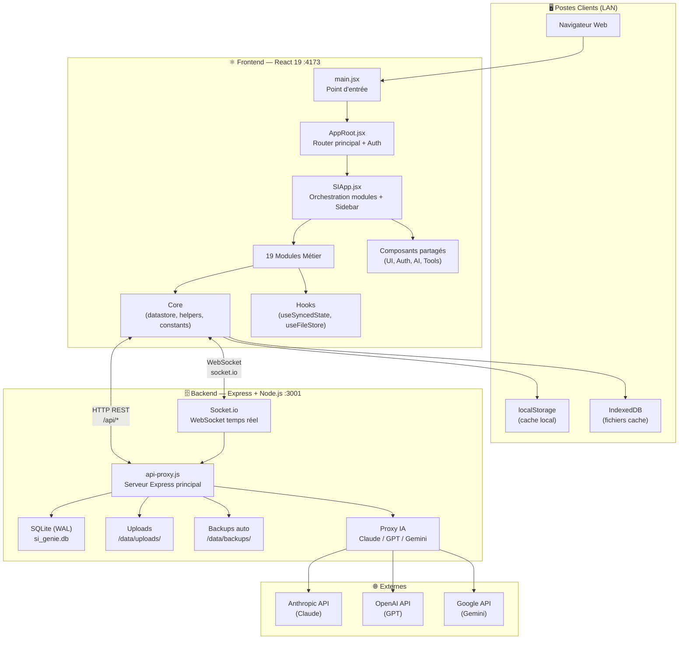
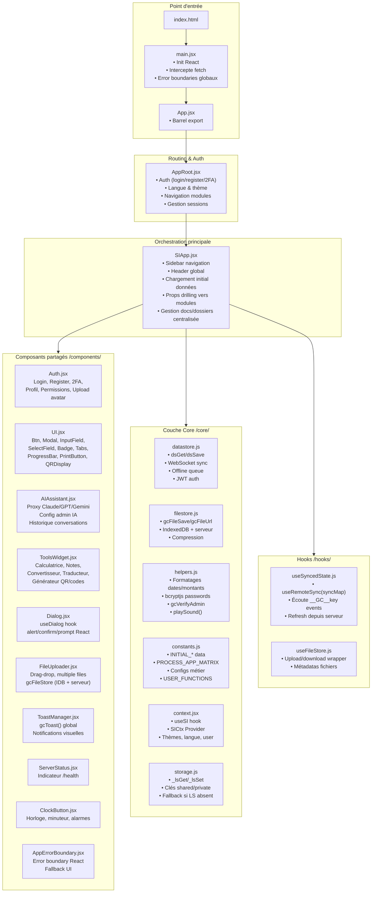
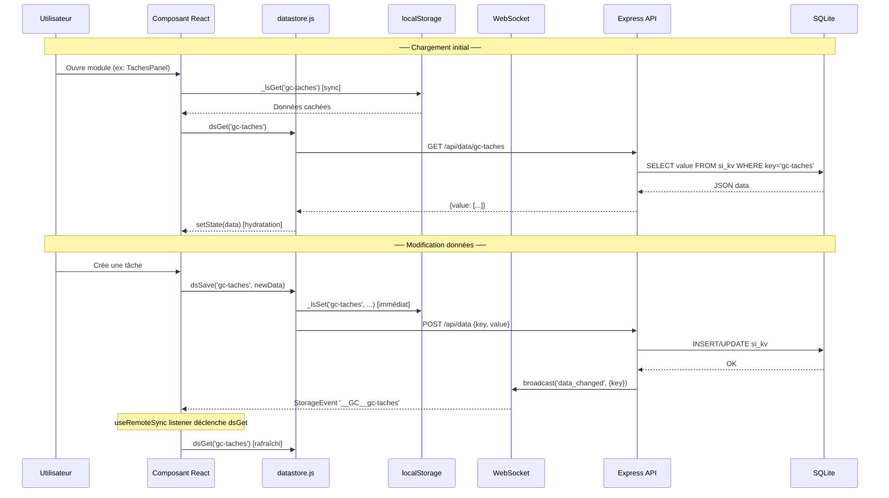
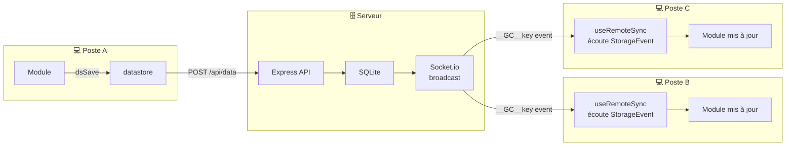
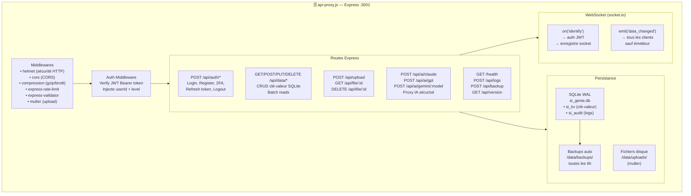
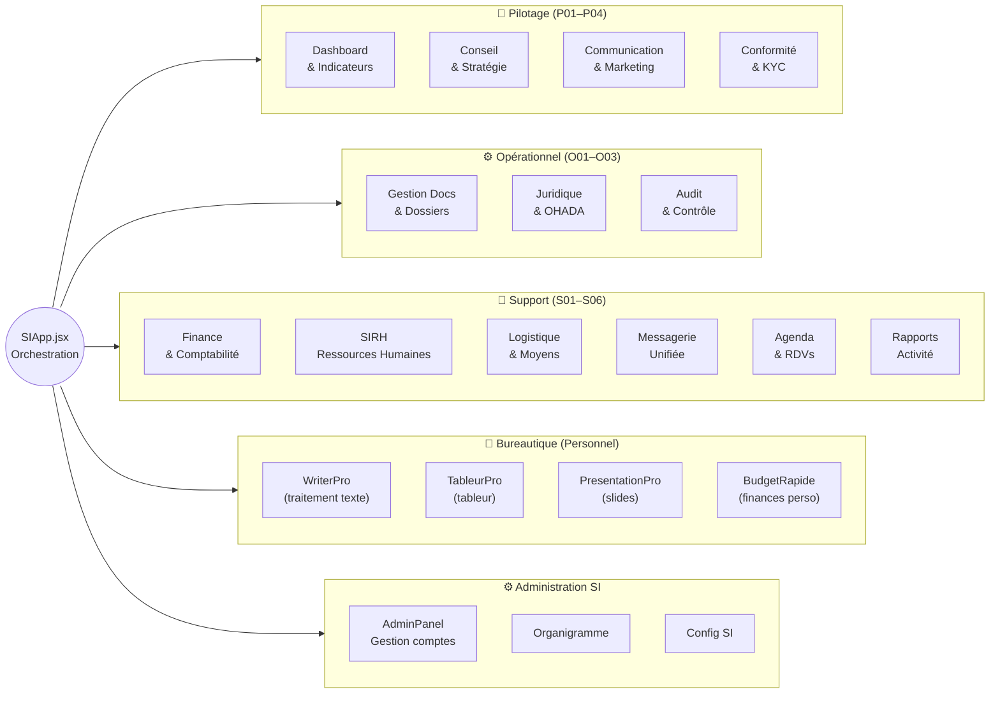
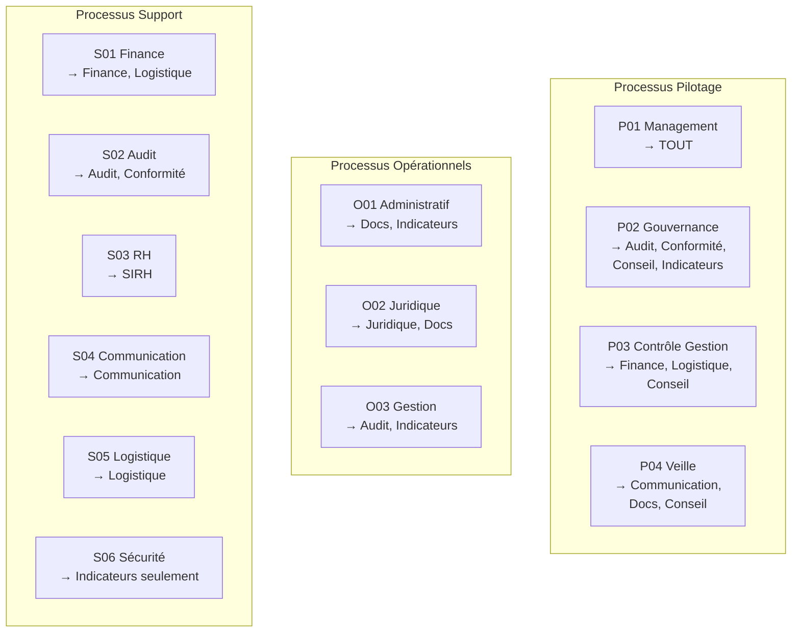
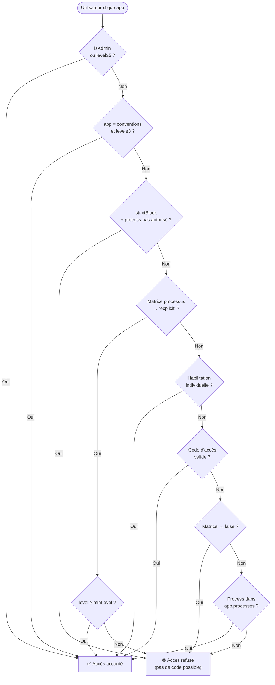
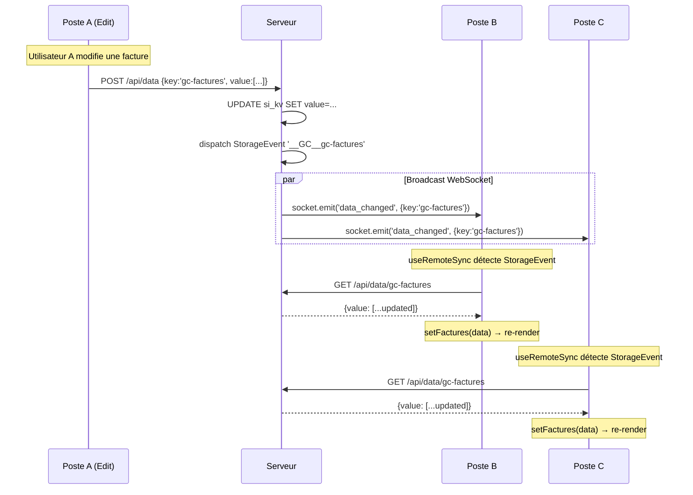
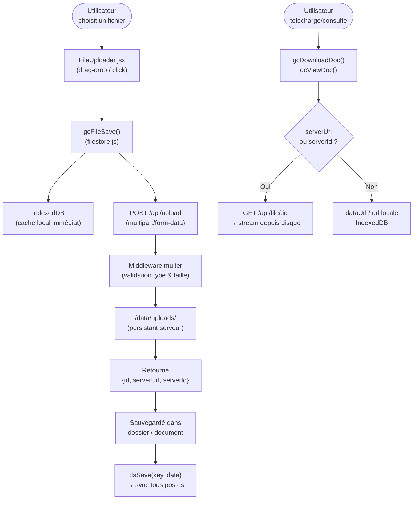

# Cartographie Technique — SI Génie Consultant
> Version 10.5.1 / 10.6.0 · Juin 2026 · Document interne confidentiel

---

## Table des matières

1. [Vue d'ensemble](#vue-densemble)
2. [Architecture globale](#architecture-globale)
3. [Frontend — Structure React](#frontend--structure-react)
4. [Frontend — Flux de données](#frontend--flux-de-données)
5. [Backend — Serveur Express](#backend--serveur-express)
6. [Backend — Routes API & WebSocket](#backend--routes-api--websocket)
7. [Modules métier](#modules-métier)
8. [Sécurité & Contrôle d'accès](#sécurité--contrôle-daccès)
9. [Synchronisation temps réel](#synchronisation-temps-réel)
10. [Gestion des fichiers](#gestion-des-fichiers)
11. [Données & Persistance](#données--persistance)
12. [Tests & Qualité](#tests--qualité)
13. [Déploiement](#déploiement)
14. [UI/UX — Description fonctionnelle](#uiux--description-fonctionnelle)

---

## Vue d'ensemble

```
┌──────────────────────────────────────────────────────────────────────┐
│                     SI GÉNIE CONSULTANT                              │
│               Système d'Information Intégré — LAN                   │
│                                                                      │
│   Frontend React 19        ←WebSocket→       Backend Express        │
│   :4173 (Vite preview)    ←HTTP REST→        :3001 (Node.js)        │
│                                              │                       │
│   • 19 modules métier                        • SQLite (WAL)         │
│   • Suite bureautique                        • Upload fichiers       │
│   • Authentification JWT                     • Proxy IA (Claude/GPT)│
│   • Contrôle d'accès par processus           • Backup auto 6h       │
│   • UI 100% temps réel                       • Logs audit           │
└──────────────────────────────────────────────────────────────────────┘
```

---

## Architecture globale



---

## Frontend — Structure React



### Arborescence fichiers Frontend

```
src/
├── main.jsx                    # Point d'entrée, error boundaries, fetch interceptor
├── App.jsx                     # Barrel
├── AppRoot.jsx                 # Router principal (1703 lignes)
├── SIApp.jsx                   # Orchestration (2303 lignes)
├── index.css / App.css         # Styles globaux
│
├── components/
│   ├── Auth.jsx                # Auth complète (3868 lignes)
│   ├── UI.jsx                  # Librairie composants (1197 lignes)
│   ├── AIAssistant.jsx         # Assistant IA intégré (1793 lignes)
│   ├── ToolsWidget.jsx         # Widget outils flottants (1425 lignes)
│   ├── Dialog.jsx              # Dialogs React (242 lignes)
│   ├── FileUploader.jsx        # Upload fichiers (440 lignes)
│   ├── ToastManager.jsx        # Notifications toast (173 lignes)
│   ├── ServerStatus.jsx        # Indicateur serveur (61 lignes)
│   ├── ClockButton.jsx         # Horloge & minuteur (821 lignes)
│   ├── AppErrorBoundary.jsx    # Error boundary (82 lignes)
│   └── index.js                # Barrel export
│
├── core/
│   ├── constants.js            # Constantes globales & données initiales (2110 lignes)
│   ├── datastore.js            # Synchronisation SQLite ↔ React (1010 lignes)
│   ├── filestore.js            # Gestion fichiers IDB + serveur (579 lignes)
│   ├── helpers.js              # Utilitaires métier (840 lignes)
│   ├── context.jsx             # React Context global (655 lignes)
│   ├── storage.js              # Wrapper localStorage (311 lignes)
│   └── index.js                # Barrel export
│
├── hooks/
│   ├── useSyncedState.js       # Sync temps réel (useRemoteSync)
│   └── useFileStore.js         # Hook gestion fichiers
│
├── styles/
│   └── GlobalStyles.jsx        # Variables CSS & thèmes dynamiques
│
└── modules/
    └── [19 modules métier]     # Voir section "Modules Métier"
```

---

## Frontend — Flux de données



### Synchronisation multi-postes



---

## Backend — Serveur Express



### Structure dossiers Backend

```
api-proxy/
├── api-proxy.js            # Serveur principal (2488 lignes)
├── package.json            # v10.6.0 — express, socket.io, better-sqlite3...
├── .env                    # JWT_SECRET, PROXY_PORT, DATABASE_PATH
├── generate-jwt-secret.js  # Générateur clé JWT
├── scripts/
│   └── ensure-sqlite.cjs   # Init tables SQLite
└── data/
    ├── si_genie.db         # Base SQLite (356 KB — WAL mode)
    ├── uploads/            # Fichiers uploadés (persistants)
    └── backups/            # Snapshots auto toutes les 6h
```

---

## Backend — Routes API & WebSocket

### Routes complètes

| Méthode | Route | Auth | Description |
|---------|-------|------|-------------|
| `POST` | `/api/auth/login` | ❌ | Authentification email+password → JWT |
| `POST` | `/api/auth/register` | ❌ | Création compte |
| `POST` | `/api/auth/verify-2fa` | ❌ | Vérification code 2FA |
| `POST` | `/api/auth/refresh-token` | ✅ | Renouvellement JWT |
| `POST` | `/api/auth/logout` | ✅ | Déconnexion |
| `GET` | `/api/data/:key` | ✅ | Lire valeur par clé |
| `POST` | `/api/data` | ✅ | Écrire clé+valeur |
| `PUT` | `/api/data/:key` | ✅ | Mettre à jour |
| `DELETE` | `/api/data/:key` | ✅ | Supprimer clé |
| `GET` | `/api/data/batch` | ✅ | Lire plusieurs clés |
| `POST` | `/api/upload` | ✅ | Upload fichier (multipart) |
| `GET` | `/api/file/:id` | ✅ | Télécharger fichier |
| `DELETE` | `/api/file/:id` | ✅ | Supprimer fichier |
| `GET` | `/api/files/list` | ✅ | Lister fichiers utilisateur |
| `POST` | `/api/ai/claude` | ✅ | Proxy Anthropic Claude |
| `POST` | `/api/ai/gpt` | ✅ | Proxy OpenAI GPT |
| `POST` | `/api/ai/gemini/:model` | ✅ | Proxy Google Gemini |
| `GET` | `/health` | ❌ | Health check |
| `POST` | `/api/logs` | ✅ | Envoyer logs audit |
| `POST` | `/api/backup` | ✅ admin | Déclencher backup manuel |
| `GET` | `/api/version` | ❌ | Version API |

### Événements WebSocket

| Direction | Événement | Payload | Rôle |
|-----------|-----------|---------|------|
| Client → Server | `identify` | `{userId, userName, token}` | Auth socket + enregistrement |
| Client → Server | `data_sync_request` | `{keys: []}` | Demande sync données |
| Client → Server | `file_uploaded` | `{meta}` | Notifier upload terminé |
| Server → Client | `data_changed` | `{key, updatedAt}` | Données modifiées → refresh |
| Server → Client | `gc-sync-online` | `{data}` | Données synchronisées |
| Server → Client | `file_available` | `{fileId, meta}` | Fichier disponible |
| Server → Client | `notification` | `{type, message, userId}` | Notification push |

---

## Modules Métier



### Tableau des modules complet

| Module | Fichier principal | Lignes | Processus | Partage |
|--------|-------------------|--------|-----------|---------|
| **Admin** | `AdminPanel.jsx` + 7 panneaux | 708 KB | Admin SI | Partagé |
| **Dashboard** | `Dashboard.jsx` | 140 KB | Tous (filtré niveau) | Partagé |
| **Processus Map** | `ProcessusMap.jsx` | 133 KB | Tous | Partagé |
| **Indicateurs** | `Indicateurs.jsx` | 37 KB | Tous | Partagé |
| **Tâches** | `TachesPanel.jsx` | 58 KB | Tous | Partagé |
| **Gestion Docs** | `GestionDocsUnifiee.jsx` | 164 KB | P01, P04, O01, O02 | Partagé |
| **Dossiers** | `DossiersList.jsx` | 206 KB | P01, P04, O01, O02 | Partagé |
| **Archivage** | `ArchivagePanel.jsx` | 37 KB | P01, O01 | Partagé |
| **Finance** | `FinanceApp.jsx` | 149 KB | P01, P03, S01 🔒 | Partagé |
| **Messagerie** | `MessagerieUnifiee.jsx` | 113 KB | Tous | Partagé |
| **SIRH** | `SIRHModule.jsx` | 198 KB | P01, S03 | Partagé |
| **Bureautique** | `BureauOffice.jsx` | 233 KB | Tous | — |
| **WriterPro** | `WriterPro.jsx` | 52 KB | Tous | **Personnel** |
| **TableurPro** | `TableurPro.jsx` | 73 KB | Tous | **Personnel** |
| **PresentationPro** | `PresentationPro.jsx` | 54 KB | Tous | **Personnel** |
| **BudgetRapide** | `BudgetRapide.jsx` | 8.6 KB | Tous | **Personnel** |
| **Audit** | `AuditApp.jsx` | 172 KB | P01, P02, O03, S02 | Partagé |
| **Conformité** | `ConformiteApp.jsx` + KYC | 88 KB | P01, P02, S02 | Partagé |
| **Communication** | `CommunicationApp.jsx` | 57 KB | P01, S04 | Partagé |
| **Conseil** | `ConseilApp.jsx` | 221 KB | P01, P02, P03, P04 | Partagé |
| **Juridique** | `JuridiqueApp.jsx` | 63 KB | P01, O02 | Partagé |
| **Logistique** | `LogistiqueApp.jsx` | 41 KB | P01, P03, S01, S05 | Partagé |
| **Agenda** | `AgendaModule.jsx` | 57 KB | Tous | Partagé |
| **Rapports** | `RapportActiviteModule.jsx` | 35 KB | Tous | Partagé |

> 🔒 Finance = `strictBlock:true` — aucun code d'accès provisoire possible, processus autorisés seulement.  
> **Personnel** = données isolées par `userId` (ne se synchronisent pas entre collaborateurs).

---

## Sécurité & Contrôle d'accès

### Niveaux utilisateurs

```
Niveau 6 — Admin SI        → Accès total, gestion infrastructure
Niveau 5 — Direction Gén.  → Accès total modules + validation finale
Niveau 4 — Responsable     → Accès modules processus + management équipe
Niveau 3 — Senior          → Accès modules processus + création dossiers
Niveau 2 — Collaborateur   → Accès restreint à son processus
Niveau 1 — Employé         → Lecture seule, tâches assignées
```

### Matrice Processus → Applications



### Flux de contrôle d'accès (hasAppAccess)



### Mécanismes de sécurité

| Mécanisme | Implémentation | Portée |
|-----------|----------------|--------|
| Authentification | JWT RS256 (8h + refresh) | Toutes routes API |
| Hash password | bcryptjs (salted) | Auth |
| Rate limiting | express-rate-limit | API globale |
| En-têtes sécurité | helmet | HTTP headers |
| CORS | cors configuré | API |
| Compression | gzip + brotli | Réponses |
| Validation inputs | express-validator | Routes data |
| Upload sécurisé | multer (taille + type) | /api/upload |
| Logs audit | si_audit table (immuable) | Actions sensibles |
| Backup auto | Snapshot SQLite toutes 6h | Persistance |
| Accès process | PROCESS_APP_MATRIX | Modules métier |
| strictBlock | Finance + apps sensibles | Blocage total |

---

## Synchronisation temps réel



### Clés synchronisées (principales)

| Clé | Module | Type |
|-----|--------|------|
| `gc-taches` | Tâches | Partagé |
| `gc-factures` | Finance | Partagé |
| `gc-devis` | Finance | Partagé |
| `gc-messages-global` | Messagerie | Partagé |
| `gc-courrier-docs` | Messagerie | Partagé |
| `dossiers` | Docs/Dossiers | Partagé |
| `gc-cabinet-info` | Admin | Partagé |
| `gc-process-app-matrix` | Admin | Partagé |
| `rdvs` | Agenda | Partagé |
| `gc-sirh-*` | SIRH | Partagé |
| `gc-writer-pro-v2:{userId}` | WriterPro | **Personnel** |
| `gc-tableur-pro:{userId}` | TableurPro | **Personnel** |
| `gc-pres-decks-v2:{userId}` | Présentation | **Personnel** |
| `gc-budget-rapide:{userId}` | Budget | **Personnel** |

---

## Gestion des fichiers



---

## Données & Persistance

### Structure SQLite

```sql
-- Table principale clé-valeur (tout le SI)
CREATE TABLE si_kv (
    key        TEXT PRIMARY KEY,
    value      TEXT,          -- JSON sérialisé
    updated_at INTEGER        -- timestamp ms
);

-- Table logs audit (immuable)
CREATE TABLE si_audit (
    id         INTEGER PRIMARY KEY AUTOINCREMENT,
    action     TEXT,          -- CREATE / UPDATE / DELETE / ACCESS
    userId     TEXT,
    resource   TEXT,          -- clé ou chemin fichier
    before     TEXT,          -- JSON état avant
    after      TEXT,          -- JSON état après
    timestamp  INTEGER        -- timestamp ms
);
```

### Stratégie de cache multicouche

```
┌─────────────────────────────────────────────────────┐
│  Couche 1 : État React (mémoire)    ← le plus rapide │
│  setState() → re-render immédiat                     │
├─────────────────────────────────────────────────────┤
│  Couche 2 : localStorage            ← sync           │
│  _lsGet / _lsSet                                    │
│  Disponible même offline                             │
├─────────────────────────────────────────────────────┤
│  Couche 3 : IndexedDB               ← fichiers       │
│  gcFileSave / gcFileUrl                             │
│  Pour les binaires (images, PDF...)                  │
├─────────────────────────────────────────────────────┤
│  Couche 4 : SQLite serveur          ← source vérité  │
│  si_genie.db (WAL mode)                             │
│  Partagé entre tous les postes                       │
│  Backups auto toutes les 6 heures                    │
└─────────────────────────────────────────────────────┘
```

---

## Tests & Qualité

### Suite Playwright E2E (20 fichiers)

```
tests/
├── si-e2e-auth.spec.ts           # Auth, 2FA, permissions
├── si-e2e-admin.spec.ts          # Admin, gestion comptes
├── si-e2e-dashboard.spec.ts      # Dashboard, KPIs
├── si-e2e-documents.spec.ts      # Upload, CRUD, permissions docs
├── si-e2e-finance.spec.ts        # Module finance
├── si-e2e-messaging.spec.ts      # Messagerie temps réel
├── si-e2e-agenda.spec.ts         # Agenda & RDVs
├── si-e2e-taches.spec.ts         # Tâches
├── si-e2e-bureautique.spec.ts    # Suite office
├── si-e2e-communication.spec.ts  # Communication
├── si-e2e-conformite.spec.ts     # Conformité & KYC
├── si-e2e-conseil.spec.ts        # Module conseil
├── si-e2e-juridique.spec.ts      # Juridique
├── si-e2e-logistique.spec.ts     # Logistique
├── si-e2e-rapports.spec.ts       # Rapports
├── si-e2e-sirh.spec.ts           # SIRH
├── si-e2e-approvals.spec.ts      # Approbations
├── si-e2e-errors-security.spec.ts# Sécurité
├── si-e2e-workflows-complete.spec.ts # Workflows métier
├── si-ci.spec.ts                 # CI/CD
└── connectivity-test.spec.ts     # Connectivité réseau
```

**Configuration Playwright :**
- Navigateurs : Edge (prioritaire), Chrome, Firefox
- Timeout : 120s · Retries : 2 (CI)
- Capture : vidéo + trace + screenshots
- Base URL : http://localhost:4173

---

## Déploiement

### Topologie réseau LAN

```
┌─────────────────────────────────────────────────┐
│                 Réseau LAN Interne               │
│                                                  │
│  ┌─────────────────┐     ┌──────────────────┐   │
│  │   Serveur Génie  │     │ Postes Clients   │   │
│  │  192.168.1.133   │     │  (n'importe quel │   │
│  │                  │     │   IP LAN)         │   │
│  │ :3001 — Backend  │◄────┤                  │   │
│  │ :4173 — Frontend │     │  Navigateur Web   │   │
│  │                  │     │  (Edge/Chrome/FF) │   │
│  │ SQLite + uploads │     │                  │   │
│  │ PM2 (auto-restart│     └──────────────────┘   │
│  └─────────────────┘                             │
└─────────────────────────────────────────────────┘
```

### Processus PM2

```json
{
  "name": "si-proxy",
  "script": "api-proxy/api-proxy.js",
  "node_args": "--max-old-space-size=512",
  "env": { "NODE_ENV": "production", "PROXY_PORT": 3001 },
  "autorestart": true,
  "restart_delay": 5000,
  "max_restarts": 10,
  "log_file": "api-proxy/data/logs/"
}
```

### Commandes démarrage

```bash
# Backend (avec PM2)
cd api-proxy && npm run pm2

# Frontend (build + preview)
npm run build && npm run preview

# Développement complet
npm run dev           # frontend :4173
cd api-proxy && npm run dev   # backend :3001
```

---

## UI/UX — Description fonctionnelle

### Identité visuelle

L'interface adopte un **thème sombre professionnel** avec trois variantes (Sombre, Clair, Marine GC). La palette principale utilise les couleurs institutionnelles de Génie Consultant — marine profond `#0A1E4A`, or `#C9A84C` — garantissant une cohérence visuelle forte. Chaque module métier possède sa propre couleur d'accentuation pour une identification rapide.

### Navigation principale

La **sidebar latérale** est organisée en sections hiérarchiques : Bureau (apps personnelles), Modules Métier (filtré par processus), Outils Transversaux (Messagerie, Agenda, Tâches). Les modules inaccessibles sont masqués ou grisés selon les droits de l'utilisateur, sans exposer leur existence au mauvais profil.

Le **header** affiche en permanence l'identité de l'utilisateur connecté, son niveau, les notifications actives, l'accès à l'assistant IA et le widget d'outils rapides. Une horloge temps réel et un indicateur de statut serveur complètent la barre de navigation.

### Système de thèmes

L'objet `T` (Theme) est injecté dans chaque composant et contient toutes les variables CSS dynamiques : couleurs de surface (4 niveaux), couleurs de texte (3 variantes), couleurs d'accentuation, bordures. Le passage d'un thème à l'autre est instantané sans rechargement.

### Formulaires & Saisie

Tous les formulaires utilisent des composants standardisés (`InputField`, `SelectField`, `NationaliteField`) garantissant une expérience homogène. Les validations sont faites en temps réel avec retours visuels immédiats. Les dialogues de confirmation (`gcAlert`, `gcConfirm`, `gcPrompt`) remplacent les `window.alert` natifs par des modals stylisées contextuelles.

### Gestion documentaire

L'interface des dossiers et documents est construite autour d'une **liste filtrable multi-colonnes** avec recherche full-text, filtres par statut/processus/date, et actions en masse. Chaque document dispose de boutons d'action contextuels (Voir, Télécharger, Supprimer) visibles uniquement si l'utilisateur a les droits correspondants.

### Feedback utilisateur

Le système de feedback utilise plusieurs canaux simultanés :
- **Toasts** (bas-droite) pour les confirmations non bloquantes
- **Banners SmartBanner** pour les alertes importantes en contexte
- **Badges** animés sur les icônes sidebar pour les compteurs de notifications
- **Progress indicators** pour les uploads et opérations longues
- **Dialogs modaux** pour les confirmations destructives

### Suite Bureautique (Personnel)

Les applications WriterPro, TableurPro et PresentationPro présentent des interfaces **inspirées des suites office professionnelles** avec barres d'outils riches, menus contextuels, raccourcis clavier, et prévisualisation temps réel. BudgetRapide offre un tableau de bord financier simplifié avec graphiques instantanés. Ces données restent **strictement privées** à chaque utilisateur.

### Assistant IA intégré

Un panneau latéral rétractable donne accès à l'assistant IA (Claude/GPT/Gemini configurable par l'admin). L'assistant est **conscient du contexte du module actif** et adapte ses réponses aux problématiques métier en cours. L'historique des conversations est conservé par session.

### Responsive & Accessibilité

L'interface est optimisée pour les **écrans 1280px–2560px** en mode paysage (usage bureau). La navigation clavier est supportée sur tous les formulaires et modals. Les contrastes respectent les ratios WCAG AA pour les textes principaux.

---

## Statistiques

| Métrique | Valeur |
|----------|--------|
| Modules métier | 19 |
| Composants React | 70+ |
| Hooks personnalisés | 2 |
| Routes API | 21+ |
| Événements WebSocket | 7 |
| Fichiers specs de tests | 20 |
| Lignes de code total | ~50 000 |
| Version Frontend | 10.5.1 |
| Version Backend | 10.6.0 |
| Base de données | SQLite 356 KB |

---

*Document généré le 03 juin 2026 — Confidentiel — Usage interne Génie Consultant uniquement*
